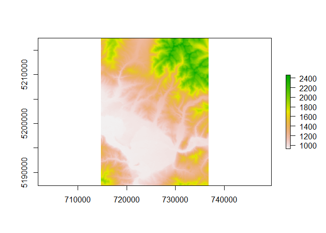
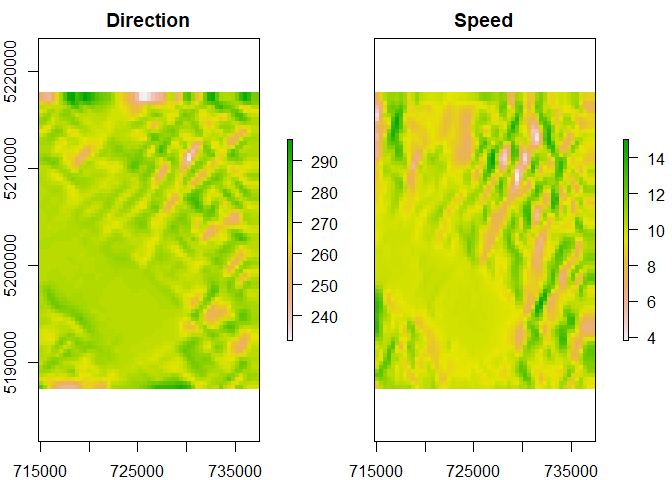

<!-- README.md is generated from README.Rmd. Please edit that file -->

# windninjr

<!-- badges: start -->

[](https://www.tidyverse.org/lifecycle/#experimental)
[](https://github.com/SCAR-sandpit/windninjr/actions)
<!-- badges: end -->

Helper functions for running WindNinja from R.

Be warned: this package is in an early stage of development with only
limited functionality so far\!

## Installation

You can install windninjr from [GitHub](https://github.com/) with:

``` r
# install.packages("devtools")
devtools::install_github("SCAR-sandpit/windninjr")
```

## Example

``` r
library(windninjr)

## WindNinja is not on my system path, so I need to tell windninjr where it is
wn_find_exe("/bin/windows/WindNinja")
#> /bin/windows/WindNinja/WindNinja-3.6.0/bin/WindNinja_cli.exe

## plot the example DEM
library(raster)
demfile <- wn_demo_file("missoula_valley_elevation")
plot(raster(demfile))
```



``` r

## set up a domain-average model run with 10m/s winds blowing towards the west
my_config <- wn_config_domain_average(elevation = demfile,
                                      input_speed = 10, input_direction = 270)

## run it
res <- wn_run(my_config)
#> Run 0: Reading elevation file...
#> Run 0: Run number 0 started with 7 threads.
#> Run 0: Generating mesh...
#> Run 0: Initializing flow...
#> Run 0: Building equations...
#> Run 0: Solving...
#> Run 0 (solver): 17% complete
#> Run 0 (solver): 48% complete
#> Run 0 (solver): 74% complete
#> Run 0 (solver): 91% complete
#> Run 0 (solver): 98% complete
#> Run 0 (solver): 100% complete
#> Run 0: Writing output files...
#> Run 0: Meshing time was 0.003383 seconds.
#> Run 0: Initialization time was 0.053820 seconds.
#> Run 0: Equation building time was 0.040141 seconds.
#> Run 0: Solver time was 0.289217 seconds.
#> Run 0: Output writing time was 0.031570 seconds.
#> Run 0: Total simulation time was 0.437994 seconds.
#> Run 0: Run number 0 done!

## what outputs do we have?
dir(res$output_dir)
#> [1] "file16e0424b1b9d.cfg"                "missoula_valley_270_10_413m_ang.asc"
#> [3] "missoula_valley_270_10_413m_ang.prj" "missoula_valley_270_10_413m_cld.asc"
#> [5] "missoula_valley_270_10_413m_cld.prj" "missoula_valley_270_10_413m_vel.asc"
#> [7] "missoula_valley_270_10_413m_vel.prj"

## read the modelled wind speed and direction
x <- wn_read(res$output_dir)
plot(x, main = c("Direction", "Speed"))
```


